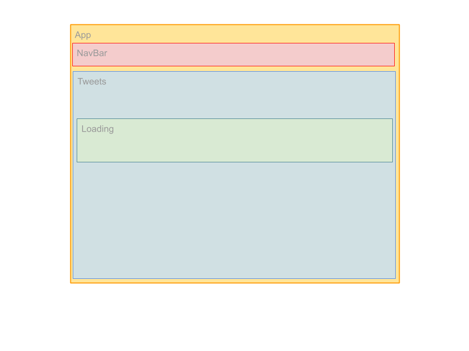
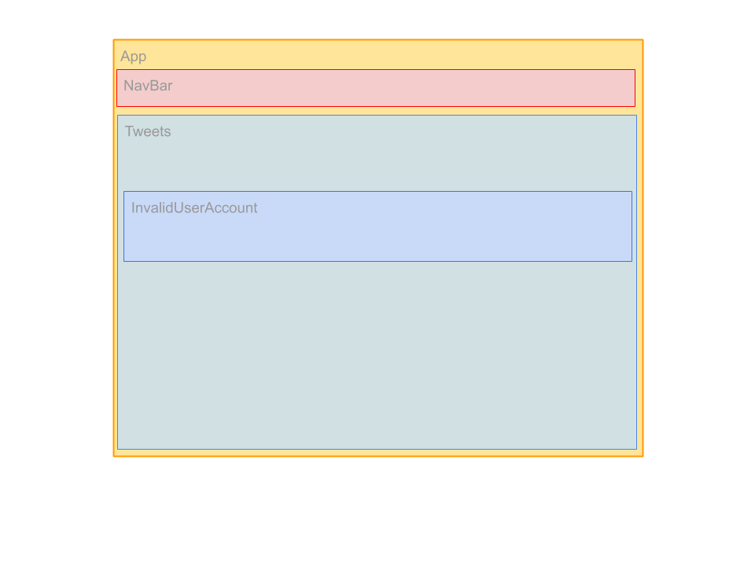
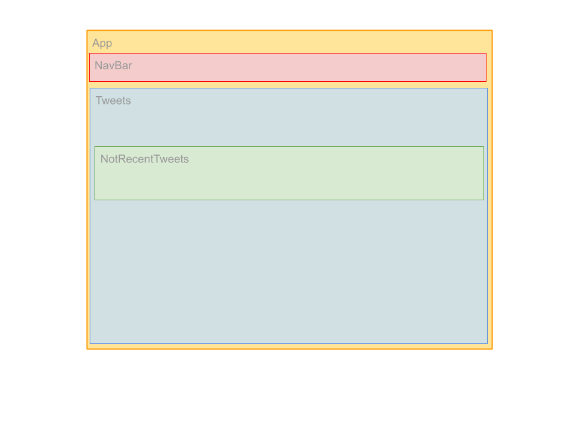
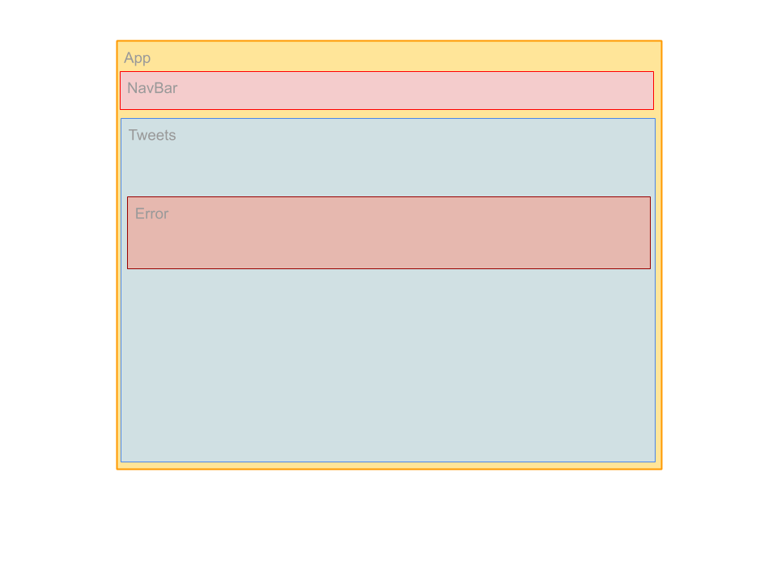
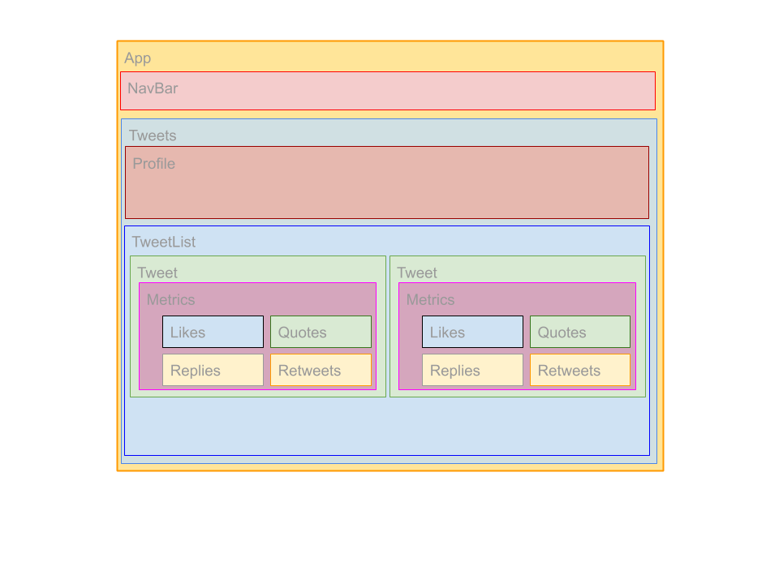

## Components map
Depends on application state, components map can be one of next:

### Loading user info or tweets

### When retrieved user is not valid

### When retrieved user has no tweets

### When received error from Twitter API

### Showing user profile and user tweets

## Components documentation

#### \<Error />
Component used for show Twitter API errors
>Twitter API is comsumed through `services/TwitterService.js` and use `axios`. 
>
>Note that `axios`interceptors and response parsers are configured in `setupAxios.js`

#### \<InvalidUserAccount />
Component used for show error when looked for account is not valid. (User doesn't exists)

#### \<Likes />
Component used for show a tweet likes, with it's icon

#### \<Loading />
Component used for show spinner when application is loading data from Twitter API

#### \<Message />
Component used for show a message with formatted text

#### \<Metrics />
Component used for show a tweet metrics (Likes, Quotes, Replies and Retweets)

#### \<NavBar />
Component used for show application top navigation bar including user search text input and button

#### \<NotRecentTweets />
Component used for show error when selected user has not recent tweets published

#### \<NotUser />
Component used for show error when is not selected user

#### \<Profile />
Component used for show selected user profile

#### \<Quotes />
Component used for show a tweet quotes, with it's icon

#### \<Replies />
Component used for show a tweet replies, with it's icon

#### \<Retweets />
Component used for show a tweet retweets, with it's icon

#### \<Tweet />
Component used for show a user tweet

#### \<TweetList />
Component used for show a user tweet list

#### \<UserSearch />
Component used for show user search text input and button

## Application Context
Context is defined in `providers/TwitterContextProvider.js`. 

It wraps nested components giving it access to state through _TwitterReducer_ placed in `reducers/TwitterReducer.js`

## Twitter Api consumer
Twitter api is accessed trough _TwitterService_ which is defined in `services/TwitterService.js` and is consumed by _TwitterApi_ wich is defined in `api/TwitterApi.js`, that manages application state, dispatching actions.

It wraps nested components giving it access to state through _TwitterReducer_ placed in `reducers/TwitterReducer.js`

## Actions
Defined actions for TwitterApi are:
* _LoadTweetsAction_ 
> dispatched for load tweets for username
* _LoadTweetsFailedAction_
> dispatched when tweets form user are loaded successfully
* _LoadTweetsSuccessfullyAction_
>dispatched when an error is received at load tweets from user
* _LoadUserAction_
>dispatched for load user info
* _LoadUserFailedAction_
>dispatched when user info is loaded successfully
* _LoadUserSuccessfullyAction_
>dispatched when an error is received at load user info

